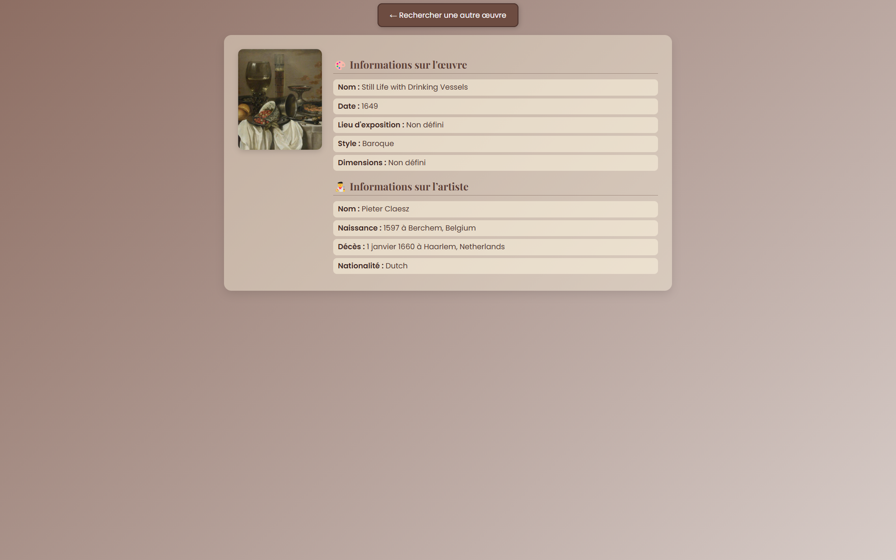

# 🎨 Trophée NSI - Recherche d'Œuvres d'Art


## 📜 Description

Le projet **Trophée NSI - Recherche d'Œuvres d'Art** est une application web qui permet aux utilisateurs d'envoyer une image d'une œuvre d'art 🖼️. Ensuite, l'application utilise le hash de l'image pour l'identifier et renvoyer des informations sur l'œuvre. Ce projet a été développé dans le cadre du concours **Trophée NSI**.

## 🚀 Fonctionnalités
- Crawler les informations d'une galerie d'art 🎭.
- Upload d'une image d'œuvre d'art 📤.
- Envoie du formulaire pour effectuer une recherche sur l'image uploadée 🔍.
- Affichage d'informations sur l'œuvre (nom, artiste, date, etc.) 📚.

## 🎯 Fonction seuil

Un champ "Seuil" est présent sur la page d’accueil. Il permet de régler la tolérance de la recherche d'œuvres similaires (valeurs recommandées : 0 à 20).  
Un seuil faible recherche des copies très proches, un seuil élevé élargit la recherche.

## ⚙️ Technologies

| 🔧 Outil / Langage | 💡 Utilisation                      |
|--------------------|-------------------------------------|
**** | Pour structurer la page et la mise en forme 🏗️|
|**** | Pour le style et la mise en page responsive 📱|
|**** | Dynamiser la page, notamment pour la prévisualisation d'image 💻|
|**** | Framework backend pour gérer le serveur Flask et les requêtes 🐍|

## 🛠️ Installation

### Prérequis
- Python 3.x 🐍
- Pip 📦

### Étapes d'installation :

1. Cloner le projet sur votre machine 💻 :
   ```bash
   git clone https://github.com/Nnova13/2025_1093_revers-art.git
   cd 2025_1093_revers-art
   ```

2. Télécharger les modules 📦 :
   ```bash
   pip install -r requirements.txt
   ```

3. Lancer le serveur Flask 🚀 :
   ```bash
   python ./source/main.py
   ```

4. Ouvrir le navigateur 🌍 :
   ```url
   http://127.0.0.1:5000
   ```

## 📷 Aperçu visuel

| Page d'accueil | Résultat |
|----------------|----------|
|  |  |


## 🚧 Roadmap

- [X] ❌ Page d'erreur à perfectioner
- [X] 📥 Implémentation du téléchargement pour la version App
- [X] 🎯 Ajouter un fonctionalité pour gérer le seuil du comparaison du hash
- [ ] 📗 Augmenter le nombre d'œuvre dans la base de donnée
- [ ] 🇫🇷  Ajuster le rendu des informations entièrement en français
- [ ] 📱 Mettre en marche la version App
- [ ] 💬 Ajouter un système de logs ou de console debug propre
- [ ] 🔒 Ajouter une gestion d’erreur plus fine (upload invalide, mauvais format)
- [ ] 📦 Packager le projet avec setup.py ou en .exe via pyinstaller pour Tkinter
- [ ] ✨ Ajouter une page "À propos" ou crédits

## 👨‍💻 Auteurs

- **Nnova** - [Nnova13](https://github.com/Nnova13)
- **Laaw** - [laawbitchh](https://github.com/laawbitchh)
- **DevByMatheo** - [DevByMatheo](https://github.com/DevByMatheo)
- **KartToonOFF** - [KartToonOFF](https://github.com/KartToonOFF)